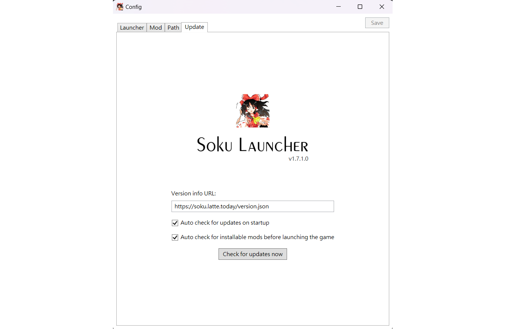

# SokuLauncher

  
  
Configuring mods(SWRSToys) before launching the game and provide automatic mod updates and download missing mods.  

### Launch and apply module configuration
Just with a single click, SokuLauncher will automatically switch mods and launch the game.  

### Automatically install missing mods
When missing mods are detected before launch, a prompt to download and install the mods will pop up.

### Desktop shortcut
Create a desktop shortcut icon that quickly opens the specified mod setting and still performs automatic update checks when launched from the shortcut.

## Install
Download SokuLauncher and place it in the main directory of th123.  

*If you are using a 32-bit operating system, please place SokuLauncher in the ``parent directory`` or ``subdirectory`` of th123's main directory.   
Alternatively, you can place it elsewhere and set the location of th123 executable in the Config.*

## Config
### Custom launcher
You can customize the appearance of the launcher and configure which mods to enable at launch.  

  
### Mod
Mods can be turned on/off or deleted from this page.

  
### Game startup path
You can set the location of the game executable here.  
This setting is necessary if you haven't placed SokuLauncher near th123 folder.

  
### Update
Version info source and related update options.
SokuLauncher provides automatic update and installation of missing mods. If you don't need these features, you can also disable them here.
